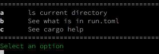

# Run

A simple terminal menu to run commands.

## Install

```
cargo install run
```

Make sure downloaded cargo binaries are in your PATH. 

## Configuration

Create a `run.toml` e.g.:

```
[[item]]
code = "a"
desc = "ls current directory"
cmd = "ls -a"

[[item]]
code = "b"
desc = "See what is in run.toml"
cmd = "cat ./run.toml"
```

Then running `run` will show a menu:

